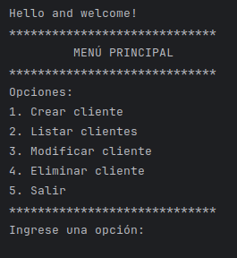
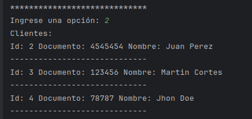
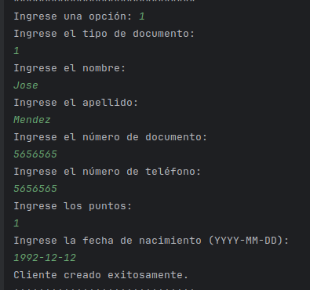

# GA7-220501096-AA2-EV01 - CODIFICACIÓN DE MÓDULOS DEL SOFTWARE SEGÚN REQUERIMIENTOS DEL PROYECTO – CAFT

---

## INSTRUCTOR
Carlos Alberto Fuel Tulcan

## APRENDIZ
William Alfonso Cortés Romero

---

**PROGRAMA:** TECNÓLOGO EN ANÁLISIS Y DESARROLLO DE SOFTWARE  
**FICHA:** 2627092 ANTES 2627093  
**SERVICIO NACIONAL DE APRENDIZAJE-SENA**  
**CENTRO DE FORMACIÓN COMERCIO Y TURISMO**  
**REGIONAL-QUINDÍO**  
**Año:** 2024

---

## Descripción del Código
- [x] ClientDAO
La clase ClientDAO es responsable de realizar operaciones CRUD en la tabla clients de la base de datos. Contiene métodos para crear un nuevo cliente, obtener todos los clientes, actualizar un cliente existente, eliminar un cliente y obtener un cliente por su ID.


- [x] DBConnection
La clase DBConnection gestiona la conexión a la base de datos MySQL. Proporciona un método estático getConnection() para obtener la conexión real.


- [x] Client
La clase Client representa un cliente del sistema. Contiene atributos como id del cliente, tipo de documento, nombre, apellido, número de documento, número de teléfono, puntos y fecha de nacimiento. También incluye métodos para acceder y establecer los valores de los atributos, así como un método toString() para representar el objeto como una cadena de texto.


- [x] MenuHandler
La clase MenuHandler maneja la lógica del menú de la aplicación en la consola. Muestra las opciones disponibles y llama a los controladores correspondientes según la opción seleccionada por el usuario.


- [x] ListClientsHandler
La clase ListClientsHandler maneja la lógica para listar todos los clientes almacenados en la base de datos. Obtiene la lista de clientes del objeto ClientDAO y los muestra en la consola en un formato tabular.


- [x] ClientUpdateHandler
La clase ClientUpdateHandler maneja la lógica para actualizar la información de un cliente existente en la base de datos. Solicita al usuario el ID del cliente que desea actualizar, luego solicita y valida los nuevos datos del cliente y finalmente llama al método updateClient del objeto ClientDAO para actualizar el cliente en la base de datos.


- [x] ClientDeleteHandler
La clase ClientDeleteHandler maneja la lógica para eliminar un cliente existente de la base de datos. Solicita al usuario el ID del cliente que desea eliminar y luego llama al método deleteClient del objeto ClientDAO para eliminar el cliente de la base de datos.


Este código proporciona una aplicación simple de gestión de clientes que interactúa con una base de datos MySQL. Permite realizar operaciones CRUD en la tabla de clientes a través de una interfaz de línea de comandos en la consola.


---

## Instrucciones de Ejecución

1. **Clonar el Repositorio:**
   Clona el repositorio desde GitHub en tu máquina local utilizando el siguiente comando:

``` 
git clone https://github.com/WilliamCortes/GA7-220501096-AA2-EV01-CODIFICACION_DE_MODULOS.git
```


2. **Configurar la Base de Datos:**
   Asegúrate de tener una base de datos MySQL en ejecución. Puedes importar el esquema de base de datos proporcionado en el archivo `database.sql`.


3. **Configurar la Conexión a la Base de Datos:**
   En la clase `DBConnection` dentro del paquete `controllers`, asegúrate de actualizar la URL, el usuario y la contraseña para que coincidan con tu configuración de base de datos MySQL.


4. **Ejecutar el Proyecto desde el IDE:**
   Abre tu entorno de desarrollo preferido y carga el proyecto. Luego, busca la clase principal denominada Main y ejecútala haciendo clic en el botón de ejecución. Esto iniciará la aplicación y mostrará el menú principal en la consola.


5. **Explorar las Funcionalidades:**
   Sigue las instrucciones en la consola para explorar las diferentes funcionalidades de la aplicación, como crear, listar, actualizar y eliminar clientes.


---


- Este es el menu principal debes selecionar un numero entre 1 y 5:



- Ejemplo de listar los clientes en la dase de datos, opcion 2:



- Restriciónes al crear un nuevo usuario que debes tener en cuenta:  
-[x] El tipo de documento ya debe estar creado en la tabla ```documentType```
-[x] La fecha debe estar en el formato indicado: ```YYYY-MM-DD```



**Nota**: Asegúrate de seguir las restricciones y consideraciones indicadas a continuación para evitar posibles errores que podrían romper el programa.

Power By Will I am ❤️.